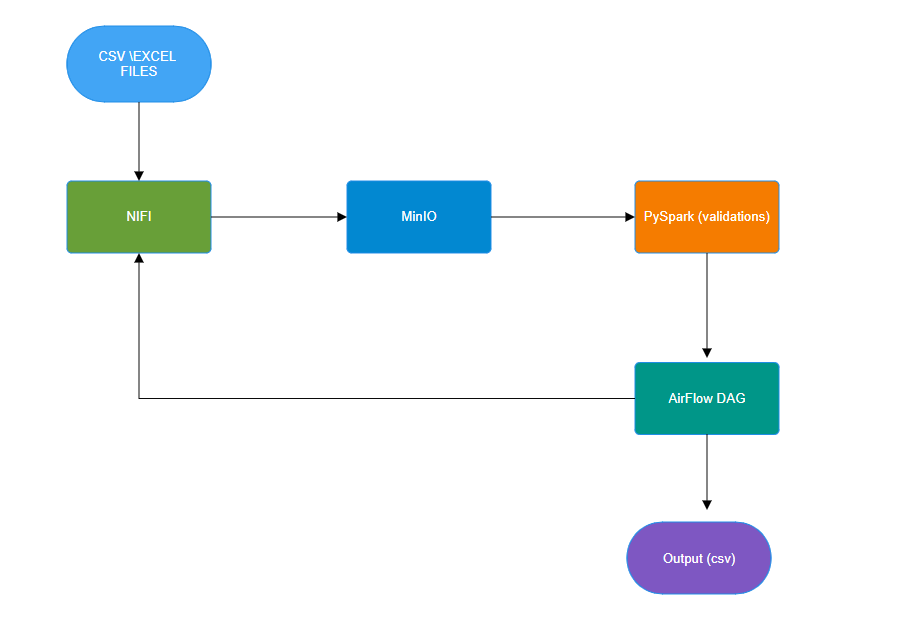

# LendingClub ETL Data Quality Validation System

## 🚀 Project Overview

This project simulates a data quality validation system for a peer-to-peer lending company (LendingClub).  
The data passes through an ETL pipeline and is validated using PySpark, orchestrated by Airflow and NiFi, and stored in MinIO.
By automatically processing loan data and executing daily data quality checks, business stakeholders at LendingClub can efficiently work with clean datasets, extract meaningful insights, and make data-driven decisions with confidence.


## 📦 Technologies Used

- **Docker**: Container orchestration tool that manages all project services.
- **Apache NiFi**: Used for data ingestion, ETL pipeline creation, and metadata management.
- **MinIO**: S3-compatible object storage for saving files in various formats (CSV, Parquet).
- **PySpark**: Big data processing and validation using the Spark distributed engine.
- **Apache Airflow**: Workflow scheduling and orchestration for automated data pipelines.
-- **PostgreSQL** (in consideration): Stores logging and validation results.
- **CSV Status Report**: Visualization or reporting of validation results.


## 🔄 Data Flow

CSV & XLSX files → NiFi → MinIO → PySpark (Validations) → Airflow DAG → Output (CSV / PostgreSQL)

### Pipeline Diagram:




## 📋 Process Steps

1. Upload raw data files (CSV/XLSX) to MinIO.
2. Ingest files using NiFi and manage data flow.
3. Run PySpark-based data quality checks.
4. Store clean data in Parquet format.
5. Use Airflow DAG to schedule and orchestrate the validation process.
6. Output validation results to CSV or PostgreSQL.


## 🧪 Validation Types Implemented (including PySpark functions names)


- **Completeness**: `check_nulls`, `count_records`.
- **Uniqueness**: `check_duplicates`, `duplicated_files_by_name_and_size`.
- **Consistency**: `check_consistency`, `dtype_consistency`.
- **Foreign Key**: `check_foreign_key`.
- **Validations**: `validate_numeric_range`, `validate_date_format`, `validate_values_length`, `validate_allowed_values`.
- **Freshness**: `file_timeliness`, `validate_date_range`.
- **Accuracy**: `validate_sum`, `moving_average`.


## 📁 File Structure


```
├── data/
├── scripts/
├── dags/
├── results/
├── README.md
├── dqa_specification.md
├── docker-compose.yml 
```


## ⚙️ How to Run the Project 
```bash
# docker-compose.yaml:
locate the file in the path of your Docker source files.

# Start services 
docker-compose up -d

# Run PySpark validation script
python scripts/run_dqa.py

```
---


## 📊 Output Example


Validation results are saved to `results/status_table.csv`.
The output includes the test case ID, file name, status (pass/fail), and the log message.


## 📄 Full DQA Specification

See dqa_specification.md for detailed validation logic and column mapping.

